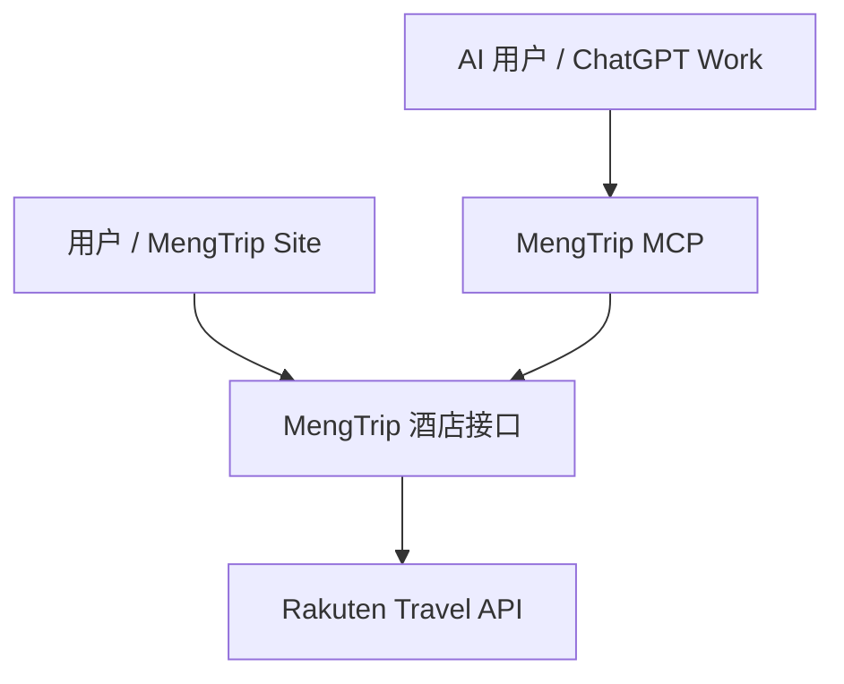

# ✈️ MengTrip — AI Travel Planner & Japan Travel Resource Layer

连接中文旅行用户、AI Agent 与日本旅行资源（Japan Travel Resource Layer for AI Agents）。

一个基于 AI 的旅行行程生成工具（MVP版本），当前支持：
- 自动生成旅行行程
- 输入辅助：支持一键填入示例，并通过快捷标签补充旅行需求
- 结构化展示（表格 + 分天结构）
- 微信收款码 ¥9.90 单份行程 PDF 自助导出体验
- “我的旅行”本地历史记录
- 页面刷新后恢复当前行程
- 百度统计事件埋点
- 页面内轻量用户反馈（无需登录）
- Rakuten Travel 真实酒店搜索（REST API + MCP）
- Viator 真实日本当地体验搜索（REST API + MCP）
- Rakuten Ichiba 真实日本商品搜索（REST API + MCP）
- 日本当地资源示例库搜索（20 条静态资源）

---

## 🚀 项目简介

本项目是一个轻量级 AI 旅行助手，用户只需输入旅行需求，即可自动生成完整行程，并支持保存、恢复和导出 PDF 文件。

核心目标：
- 降低旅行规划成本
- 提供结构化、可保存、可恢复、可导出的行程
- 先验证真实用户使用体验，再逐步扩展商业化能力
- 构建未来可扩展的 AI Travel Infrastructure

---

## ✅ Current MVP Status（2026-10-02）

当前项目目前有两个相互关联但用途不同的用户入口：

### MengTrip Unified Travel Demo V1（2026-10-02 冻结版）
- Site：MengTrip Japan Local Resource Site
- AI 自动生成日本旅行行程，并以 Trip Card 展示，可打开查看完整行程
- Rakuten Travel 真实酒店搜索：桌面端按 3 列 × 2 行展示，最多 6 条
- Viator 真实日本当地体验搜索：桌面端按 3 列 × 2 行展示，最多 6 条
- Rakuten Ichiba 真实日本商品搜索：默认展示 6 条，并保留供应商 Affiliate URL（如返回）
- MengTrip Japan Local Resource 当地资源搜索
- 当前 Site 的 AI 行程详情不提供 PDF 下载、支付按钮或导出触发逻辑
- 已完成 PC 端人工验收；现阶段作为统一旅行 Demo 冻结，后续优先考虑让 AI 行程与酒店 / 体验 / 商品资源进一步联动

统一 Site 当前产品链路：

**输入旅行需求 → AI 生成行程 → Trip Card → 查看完整行程 → 搜索真实酒店 / 体验 / 商品 / 当地资源 → 跳转供应商 booking / purchase URL**

### 原 MengTrip AI Travel Planner MVP

当前核心用户链路已经完成 PC + Mobile 人工验收：

**输入旅行需求 → AI生成行程 → 免费查看并保存 → 微信扫码 ¥9.90 → 自行确认 → 下载 PDF**

当前版本重点是：
- 让用户顺畅完成核心旅行规划流程
- 通过百度统计观察真实用户行为
- 通过页面内表单收集结构化反馈
- 当前付款流程为收款码加用户自行确认，尚未接入微信支付回调或服务端订单

---

## 🧩 核心功能

### 1️⃣ AI 自动生成行程
- 输入自由文本（时间 / 人数 / 预算 / 偏好）
- 支持一键填入示例，并通过快捷标签补充旅行需求，降低首次使用门槛
- 调用 DeepSeek API
- 输出结构化 Markdown 行程
- 固定使用 5 列表格：日期、行程内容、交通工具、餐食推荐、住宿推荐
- 自动按 Day / 第X天 分组展示
- 输出预算汇总和预约清单

---

### 2️⃣ 行程可视化展示
- 自动转换 Markdown → HTML
- 表格形式展示每日安排
- 支持 PC / Mobile 响应式适配
- 自动分页（PDF打印优化）

---

### 3️⃣ PDF 导出功能
- 单份行程 ¥9.90，自行确认付款后导出 A4 PDF；同份行程在当前浏览器可再次下载
- 生成与查看行程免费；页面不自动验证付款，客户端确认记录不能作为付款凭证
- 自动生成文件名（基于用户输入）
- 支持高清导出（html2canvas）
- 针对 5 列 / 6 列表格提供 PDF 专用样式

---

### 4️⃣ 我的旅行（本地历史）
- 每次成功生成行程后自动保存到浏览器 localStorage
- 最多保留 20 条历史记录
- 按生成时间倒序展示
- 点击首页历史记录可进入对应的独立行程结果页
- 恢复后，同一份已自行确认的行程可再次下载 PDF
- 当前版本不提供删除或清空入口，重点保留已生成旅行的连续体验

---

### 5️⃣ 当前行程恢复
- 当前行程使用 localStorage 保存
- 有效期为 7 天
- 页面刷新或重新打开后可自动恢复未过期行程
- 超过有效期后自动清理当前行程缓存

---

### 6️⃣ 用户行为统计
- 接入百度统计
- 已埋点主要用户行为：
  - 生成行程点击 / 成功 / 失败
  - PDF 下载
  - PDF 导出意向 / 收款码展示 / 用户自行确认（均不代表实际到账）
  - 用户反馈打开 / 提交 / 失败

---

### 7️⃣ 用户反馈
- 行程结果页底部提供“用户反馈”入口，点击后在当前页面展开
- 收集有用程度、付费意愿、希望增加的功能及可选意见
- 无需登录，不收集姓名、微信、QQ、手机号或邮箱
- 反馈提交至 Vercel 后台，以结构化日志记录
- 打开和提交反馈会同步记录百度统计事件

---

## 💰 当前收费策略

| 行为 | 当前是否收费 |
|------|--------|
| 生成行程 | 免费 |
| 下载 PDF | ¥9.90 / 份，微信扫码自助体验 |

说明：
- 二维码为固定 ¥9.90 收款码，每次下载均展示，用户支付后自行点击确认
- 无微信支付回调、服务端验单、订单管理或跨设备权益；百度统计的自确认事件不能用于统计实际收入，应以微信到账记录为准
- 前端确认流程可绕过，不适合作为正式收费门禁

---

## 🛠 技术架构

### 前端
- HTML + CSS + 原生 JavaScript

### AI
- DeepSeek API
- 通过 Vercel Proxy 调用

### 渲染
- marked.js

### PDF
- html2pdf.js
- html2canvas

### 状态管理
- localStorage

### Analytics
- 百度统计

### Feedback
- 页面内原生表单 + Vercel API

---

## 📂 项目结构

### `index.html`
首页提供需求输入、我的旅行与日本旅行资源介绍。`trip.html?id=...` 展示对应行程、PDF 下载与反馈；两页共用 `trip-app.js` 业务逻辑和 `trip-app.css` 样式，包括：
- UI（输入 / 输出）
- DeepSeek API 调用
- Markdown 渲染
- 行程分天处理
- PDF 导出
- 当前行程缓存
- “我的旅行”历史管理
- 百度统计埋点
- 页面内匿名反馈入口

---

## 🔄 当前用户流程

用户输入需求  
→ 点击生成  
→ AI 返回行程  
→ 自动进入独立行程结果页，展示结构化行程  
→ 自动保存到“我的旅行”  
→ 用户可查看 / 恢复历史行程  
→ 点击下载 PDF  
→ 展示 ¥9.90 微信收款码（每次下载均展示）\
→ 用户自行确认付款并导出 PDF\
→ 可在当前页面直接提交反馈

---

## ⚠️ 当前限制

- 无用户账号系统
- 无服务端旅行历史数据库
- “我的旅行”仅保存在当前浏览器 localStorage
- 更换浏览器 / 设备后历史记录不会同步
- 最多保留最近 20 条旅行历史
- 微信扫码付款后需用户自行确认；网站不自动验单，不保存免付费下载状态
- 已提供独立的 Rakuten 酒店信息搜索；尚未接入行程生成流程，也不提供指定入住日期的空房确认或站内预约
- AI 推荐结果仍需用户自行核实

---

## 🧪 Japan Local Resource API Demo

这是现有网站旁边的独立只读试验接口，原有行程生成、PDF 和支付页面不受影响。数据来自已整理的 20 条日本本地资源，以静态 JSON 文件保存；此当地资源接口不提供实时库存。独立的 Rakuten 酒店接口见下方 v0.2 说明。

- 数据：`data/japan-local-resources.demo.json`
- 查询：`GET https://www.mengtrip.com/api/resources?prefecture=千叶县&limit=3`
- 组合筛选：`?municipality=金泽市&category=craft`；也支持 `q`、`type`，默认返回 5 条，最多 20 条
- OpenAPI：`https://www.mengtrip.com/openapi.json`（可导入支持 OpenAPI Actions 的自定义 GPT）
- 返回 `data_type: static_demo`、来源链接、核对日期及预约入口（如有）。价格、空房、开放日和预约状态都不是实时数据。
- Gemini 的 function calling 需开发者将同一个 HTTP 接口注册为工具并在自己的应用内执行请求；发布 OpenAPI 文件本身不会让所有 Gemini 用户自动调用。

部署后可直接打开 `/api/resources?q=金箔` 验证 JSON。自定义 GPT 中导入 OpenAPI schema 后，可试问“推荐金泽的金箔体验，给我来源链接”，并在 Actions 测试面板确认实际调用。公开只读接口无账号或配额保障，正式商用前应加入密钥、全局限流与监控。资源对外推荐时请让用户到来源网站确认最新信息。

### 🤖 MCP / AI Agent Demo（v0.1，2026-09-29）

MengTrip 已在现有 Japan Local Resource API 之上增加 MCP Server，使支持 MCP 的 AI 客户端可以把 MengTrip 旅行资源作为原生工具调用，而不只是让用户直接访问网站。

**当前 MCP 共暴露 4 个只读搜索工具：** `searchJapanLocalResources`、`searchRakutenHotels`、`searchExperiences`、`searchRakutenProducts`。它们负责资源发现和返回供应商链接；当前不直接执行预约、支付或购买。

- MCP Endpoint：`https://www.mengtrip.com/mcp`
- MCP Tool：`searchJapanLocalResources`
- 支持参数：`q`、`prefecture`、`municipality`、`category`、`type`、`limit`
- Tool 底层复用现有 `/api/resources` 查询逻辑，不改变原有行程生成、PDF 与支付流程
- ChatGPT Plugin：`MengTrip Japan Local Resource` v0.5.0（2026-10-02 已同步酒店、体验、商品与当地资源说明）
- MCP `tools/list` 已成功识别 `searchJapanLocalResources`，实际 Tool Call 已成功返回 MengTrip 资源
- 2026-09-29 已在 ChatGPT Desktop App 的 Work 模式完成端到端人工验收：**ChatGPT → MengTrip Plugin → MCP → `searchJapanLocalResources` → MengTrip Japan Local Resource → AI 回答**

验收用例：“用 MengTrip 查找金泽的传统工艺体验。”成功返回 4 项静态 Demo 资源，包括金泽 Katani 金箔贴饰、今井金箔工坊、加贺友禅手帕染色和九谷光仙窑陶轮制陶，并返回来源/商家链接。

`searchJapanLocalResources` 使用 20 条静态样本数据（`data_type: static_demo`），不代表实时价格、库存、营业时间或预约结果。v0.2 新增的 `searchRakutenHotels` 返回外部 API 酒店信息，两类数据需要明确区分。


### 🎟️ MengTrip v0.3 — Experience Provider Demo（2026-10-02）

在 v0.2 的 Rakuten 酒店能力之外，MengTrip 新增统一体验搜索入口 `searchExperiences`。对 AI / Agent 暴露的是 MengTrip 的通用体验工具名，Viator 作为首个底层 Provider；未来增加其他体验供应商时，不需要改变 AI 侧调用名称。

- REST：`GET https://www.mengtrip.com/api/viator-experiences?searchTerm=Tokyo%20food%20tour&limit=5`
- MCP Endpoint：`https://www.mengtrip.com/mcp`
- MCP Tool：`searchExperiences`
- 当前 Provider：Viator Partner API（Basic Access）
- 服务端环境变量：`VIATOR_API_KEY`；密钥不得写入前端或提交 GitHub。
- 返回统一字段包括体验 ID、名称、简介、起价/币种、评分/评论数、图片和供应商 booking URL（以 Viator 实际返回字段为准）。
- 价格和可用性可能变化；MengTrip 当前不把搜索结果表述为确认预订。
- 2026-10-02 已完成 Production 端到端 REST 验收：`searchTerm=Tokyo food tour&limit=5` 成功返回 5 条 Viator `live_api` 体验数据，包含 JPY 起价、评分、评论数、时长、图片、免费取消标识和带 MengTrip Partner ID 的 Viator booking URL。Sandbox Key 仍可单独等待激活用于后续开发测试。
- 2026-10-02 已在 ChatGPT Desktop App 的 Work 模式完成 MCP 端到端人工验收：**ChatGPT → MengTrip Plugin → MCP `searchExperiences` → Viator Production API → 5 条真实体验结果**。测试参数为 `searchTerm="Tokyo food tour"`、`limit=5`，未使用网页搜索；返回价格、评分及带联盟归因参数的 booking URL。
- 2026-10-02 Unified Travel Demo V1 已将 Viator 体验搜索整合到统一 Site；Site 当前最多展示 6 条体验结果，并保留供应商 booking URL。

架构：

```text
ChatGPT / Gemini / AI Agent
          ↓
       MengTrip MCP
          ↓
    searchExperiences
          ↓
 Experience Provider Layer
          ↓
     Viator Provider
          ↓
      Viator API
```

### 🏨 MengTrip v0.2 — Real Travel API Demo（2026-10-01）

这一里程碑验证了同一套 MengTrip 酒店能力可同时服务 Web 用户和 AI Agent；v0.2 是功能里程碑，不表示已创建 GitHub Release 或 tag。

| 能力 | 数据来源 / 状态 |
|------|----------------|
| 当地体验与地点搜索 | MengTrip 20 条静态示例资源，`data_type: static_demo` |
| 酒店搜索 | Rakuten Travel 外部 API，`data_type: live_api` |
| 原生 MCP Tools | `searchJapanLocalResources`、`searchRakutenHotels` |
| 酒店展示 | 图片、原始名称、地址、最低价格、评分、评论数、预订链接 |
| 预订 | 跳转 Rakuten 住宿方案页面；MengTrip 不直接完成预约 |

**已验证的入口**

- [MengTrip Japan Local Resource Site](https://mengtrip-japan-local-resource.king-meng.chatgpt.site/)：酒店搜索放在顶部，下方为「MengTrip · 示例资源库」。中文界面保留酒店的日文官方名称和地址。
- REST：`GET https://www.mengtrip.com/api/rakuten-hotels?keyword=東京&limit=5`
- MCP Endpoint：`https://www.mengtrip.com/mcp`
- MCP 调用：`searchRakutenHotels({"keyword":"東京","limit":5})`

**共用后端**



MCP 的酒店工具直接复用 `api/rakuten-hotels.js` handler；当地资源工具复用 `api/resources.js`。Site 是独立前端入口，并不表示本站行程生成已自动调用酒店搜索。

**2026-10-01 人工验收记录（用户实测）**

- Site 搜索「金沢」「東京」均返回 5 家真实酒店，预订链接可跳转 Rakuten。
- ChatGPT 网页版 Work 实际调用 `searchRakutenHotels`，参数为 `{"keyword":"東京","limit":5}`，返回 5 家酒店及 `data_type: live_api`。
- 已验证明确指定工具的调用；未在此记录中确认 AI 在不指定工具名称时自动选择工具，也未确认本次酒店功能的桌面版验收。

**接口与部署**

- 参数：`keyword` 必填，最多 80 字符；`limit` 默认 5，MCP 支持 1–20，Site 最多展示 6 家。
- 返回字段：`name`、`area`、`price_from_jpy`、`rating`、`review_count`、`image`、`booking_url` 等；缺失字段可能为 `null`。
- 服务端环境变量：`RAKUTEN_APPLICATION_ID`、`RAKUTEN_ACCESS_KEY`；可选联盟配置 `RAKUTEN_AFFILIATE_ID`。配置联盟 ID 后，酒店接口将其作为 `affiliateId` 传入 Rakuten，由供应商生成链接；MengTrip 原样保留 `planListUrl` / `hotelInformationUrl`。未配置时仍可搜索，但不能据此声称链接已包含 MengTrip 联盟归因。密钥只配置在部署环境，不能写入前端或提交到仓库。
- 上游失败返回错误，不回退到模拟酒店数据。
- 源码：`api/rakuten-hotels.js`（酒店）、`api/viator-experiences.js`（体验）、`api/rakuten-products.js`（商品）、`api/mcp.js`（4 个 MCP Tools）、`api/resources.js`（静态资源）、`data/japan-local-resources.demo.json`（示例数据）。

**当前限制与下一步**

- 酒店查询是关键词匹配，不是严格城市过滤：「東京」可能匹配千叶县舞滨的酒店。
- 最低展示价格不等于指定日期、房型或人数的报价；没有入住日期查询、空房保证或预约确认。酒店接口有短时缓存，最终价格与空房以 Rakuten 页面为准。
- 当前酒店名称、地址等保留 API 原文；尚未建立中文翻译数据层。
- MCP 客户端需连接并启用 MengTrip；公开端点不意味着所有 AI 会自动发现它。
- 下一步先验证自然语言请求「帮我找 5 家东京的酒店」是否能自动选择酒店工具，再改善地区筛选；更多真实旅行 API 留作后续扩展。

---

## 🔥 下一步优化

- 持续优化真实用户体验
- 根据百度统计和页面内用户反馈迭代产品
- 增加用户系统与云端旅行历史
- 若要可靠限制访问，接入正式订单、微信支付回调与服务端验单
- 推进 AI 行程与 Rakuten 酒店 / Viator 体验 / Rakuten 商品的联动，让生成的行程进一步连接真实可预订、可购买资源
- 完善已接入的 Rakuten 酒店查询，优先验证工具自动选择及地区筛选
- 扩展已验证的 MCP / AI Agent 调用能力，逐步接入更多日本本地资源与实时 API
- 探索可保存、可分享、可共创的公共旅行行程库

---

## 🧠 项目定位

当前：**MengTrip Unified Travel Demo V1（AI 行程 + Rakuten 酒店 + Viator 体验 + Rakuten 商品 + MengTrip 当地资源）+ MCP / AI Agent 旅行资源连接层 Demo**  
中期：**完善日本旅行资源连接层，扩充真实资源、地区筛选与多语言能力**  
未来：**AI 旅行基础设施 / Agent 平台（预约与佣金闭环）**

---

## 📈 潜在商业模式

- PDF / 高级功能付费
- 订阅制
- OTA 佣金
- B2B 旅行社工具
- AI Agent / API 服务

---

## 🧠 总结

当前 MVP 的核心价值是：

> **让用户用自然语言快速生成旅行计划，并能够保存、恢复和导出。**

现阶段优先验证真实使用体验和用户需求，再逐步扩展支付、账号、云端历史、OTA 和 Agent 能力。

---

## 🧪 Development Workflow

当前项目采用轻量化 AI 协作开发流程：

**需求 → ChatGPT 分析 / 设计 / 验收标准 → Codex 或 ChatGPT 实现 → GitHub → CI → Production → 人工测试**

原则：
- 简单、低风险修改可直接提交 GitHub
- 复杂功能通过 Branch + PR + CI 完成
- Production 最终由人工进行页面和功能验收

## Production Hardening

- AI Markdown 转换后的 HTML、行程保存及本地历史恢复均经过 DOMPurify 清洗；安全组件不可用时不渲染不可信 HTML。
- 代理要求 POST 携带允许的 Origin，允许 GitHub Pages、mengtrip.com（含 www）和 localhost:3000 / localhost:5173；无 Origin 的脚本调用会返回 403。Origin/CORS 不是身份认证，非浏览器客户端仍能伪造该请求头。
- 保留请求大小、消息、token 和每 IP 频率限制。内存 rate limit 仅作用于当前 serverless 实例，不跨实例共享，冷启动会重置，不能保证全局限流。
- 客户端请求约 90 秒超时，并对 429 / 5xx 显示简短提示；客户端取消不保证上游模型停止计算。

### Affiliate link audit（2026-10-02）

- 已检查 REST 后端及 MCP 复用路径；Site 与 MCP 共用供应商返回的 `booking_url`。
- Viator Production 实测返回 `pid=P00323288`、`mcid=42383`、`medium=api`、`campaign=mengtrip`。代码已请求 `campaign-value=mengtrip`，并原样保留 API 的 `productUrl`，不手工替换 PID / MCID。
- Rakuten 后端已支持可选 `RAKUTEN_AFFILIATE_ID` 转发。2026-10-02 商品 MCP 实测已返回 `hb.afl.rakuten.co.jp` Affiliate URL；酒店 Affiliate 归因仍应以实际返回链接及 Rakuten Affiliate 后台记录为准。
- 已验证 Site / MCP 均保留供应商返回的 booking / purchase / affiliate URL；`limit=6` 展示调整不改变归因链接。
- 链接含归因参数不等于已产生收入。实际收益闭环仍需在供应商后台核对合规真实预订的归因、成果确认及佣金；本次未执行预订或支付。

### 🛍️ MengTrip v0.4 — Rakuten 商品搜索（2026-10-02）

- REST：`GET https://www.mengtrip.com/api/rakuten-products?keyword=抹茶&limit=6`
- MCP：`searchRakutenProducts({"keyword":"抹茶","limit":6})`；现有三个工具保持不变。
- 复用服务端 `RAKUTEN_APPLICATION_ID`、`RAKUTEN_ACCESS_KEY`、可选 `RAKUTEN_AFFILIATE_ID`；乐天应用需启用楽天市場API访问范围。
- 返回商品名称、JPY价格、评分、评论数、图片、店铺、`purchase_url`、`affiliate_url`。优先原样保留供应商 `affiliateUrl`；未配置联盟或供应商未返回联盟链接时，普通商品链接不能视为佣金归因。
- 线上 MCP 实际调用「抹茶」limit=6 成功返回6件真实商品，6条联盟链接。商品可能含ふるさと納税返礼品，需按商品名称确认；价格、库存及配送范围以供应商页面为准。
- 本地验证参数校验、联盟参数传递、原样链接、无联盟配置和上游失败。当前未执行购买或证明佣金到账。

### 首页发现与展示（2026-10-03）

- `index.html` 增加中文标题、description、canonical、Open Graph 和 Organization / WebSite JSON-LD。
- 首页加入静态日本酒店、当地体验、商品介绍及资源 Demo 链接；开发者说明包含 REST / MCP 接入和 OpenAPI 当前仅覆盖静态资源的范围。
- 新增 `robots.txt` 与 `sitemap.xml`（目前仅列首页）；不保证搜索引擎收录、排名或 AI 自动调用。
- 统一绿色主色、留白、卡片与手机排版；保留原有 DeepSeek 请求、行程历史、微信二维码与人民币 ¥9.90 PDF 下载逻辑。ChatGPT Site 未修改。

### 独立行程结果页（2026-10-03）

- 首页成功生成后自动跳转 `/trip.html?id=...`；首页不再展开生成行程、PDF 或用户反馈。
- 结果页保留完整行程、微信二维码、PDF 导出和用户反馈，提供返回首页 / 规划新行程链接。
- 首页“我的旅行”进入对应结果页；结果页支持刷新恢复。链接依赖当前浏览器本地历史，不能跨设备分享行程。
- 现有 AI 请求、资源 API / MCP 与 ChatGPT Site 不变。

### 公开东京行程示例（2026-10-03）

- `/tokyo-5-day-itinerary.html`：公开的东京5天4晚编辑路线示例，包含每日安排、住宿选区、交通思路、预算拆分、行前清单与官方参考链接。
- 正文为静态HTML，无需JavaScript、登录或localStorage即可读取；带独立title / description / canonical、Open Graph、Article与BreadcrumbList JSON-LD。
- 首页提供入口，sitemap.xml已包含示例页。个人生成行程仍仅保存在本地，不公开。
- 此页不提供实时报价或空房，资源查询链接进入既有Site，AI规划链接返回首页；不保证搜索引擎收录或AI推荐。

### 首页第二轮内容完善（2026-10-03）

- 首页明确定位为「MengTrip — 日本自由行与当地旅行资源」，展示酒店、体验、商品及AI行程四项服务。
- 公开路线扩展为东京5日、东京→大阪5日、大阪京都5日；新增页沿用东京示例版式，提供静态正文、独立元数据与官方参考链接，已列入sitemap。
- 增加面向旅行者与AI Agent的英文旅行资源说明，以及4项可展开FAQ；FAQ结构化数据与页面正文一致，不保证搜索展示。
- 本轮仅修改公开内容、入口和发现元数据；AI生成、结果页、微信二维码、PDF、REST/MCP与ChatGPT Site未修改。
